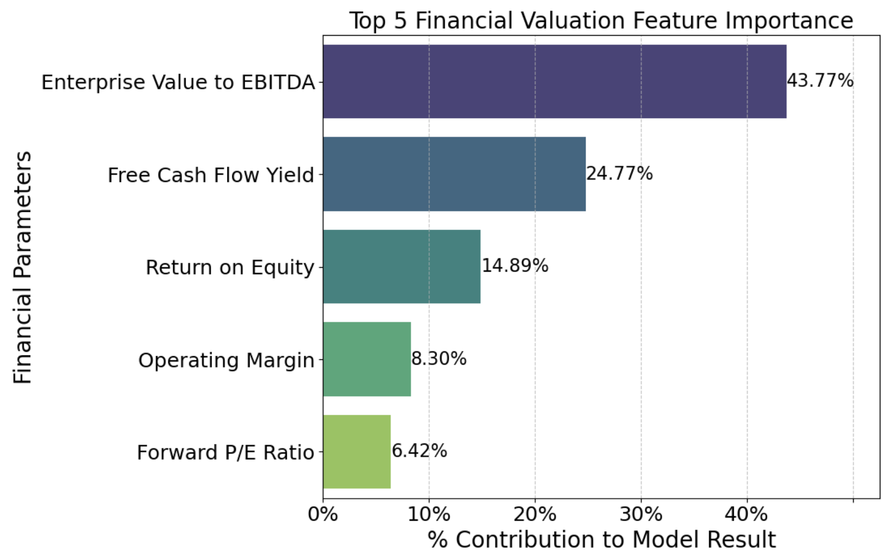
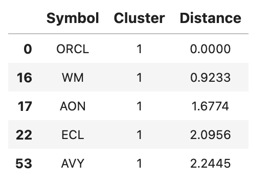

# Stock Value Proximity

## Overview
This project uses Machine Learning to create a recommendation system in which the user inputs a stock and the model outputs 5 stocks which are similar in value to the user input stock. It uses K-MEANS Clustering to take in the value of the current financial pararmeter and show the 5 stocks which are closest in euclidean distance. The 11 valuation pararmeters this model is based on are:
- Enterprise Value to EBITDA
- Free Cash Flow Yield
- Return on Equity
- Operating Margin
- Forward P/E Ratio
- Price to Sales Ratio
- Price to Book Ratio
- Trailing P/E Ratio
- Quick Ratio
- Earnings Per Share Forward
- Debt to Equity Ratio

The use of a system like this is when a value investor finds a stock, of which the value of that stock serves the purpose of the investor, (longing, shorting, finding fair value stocks, etc.) the investor can use this model to find more stocks which align closely to the inherent value of the input stock.
## Business Understanding
- **Key Business Questions:**
    - How can we save the value investor time by finding similarly valued stocks?
    - Which are the most common financial parameters to judge a stocks value?
    - What type of machine learning model should be used to create a stock value recommendation system?
    - What are the most important financial metrics when determining the value of a stock?

## Data Understanding and Analysis
- **Source of Data:** Yahoo Finance and NASDAQ.com
- **Description of Data:** Stock tickers and names, market caps, and financial metrics

- **Visualizations:**
    1. 
    2. 

 

## Conclusion
- **Summary of Conclusions:**
    1. Upon running a K-Means clustering model and tuning it with data processing and hyperparameters, we were able to come up a model that separates our ~1300 stocks into 18 groups, with the heaviest group having 186 stocks and the lightest group having 15 stocks. This was a big improvement from our baseline model, which put about 98% of stocks all into one cluster. The goal was to separate the stocks into as distinct groups as possible, which each cluster having atleast 15 stocks for the investor to choose from. 

    2. Final Model Metrics
    * Silhouette Score: 0.15. 
    * Davies-Bouldin Index: 1.12
    * Intra-Cluster Similarity: 2.1817
    * Average Inter-Cluster Distance: 11.2299

    3. Top 5 Important Financial Features
    * 1. Enterprise Value to EBITDA: 43.77%
    * 2. Free Cash Flow Yield: 24.77%
    * 3. Return on Equity: 14.89%
    * 4. Operating Margin: 8.3%
    * 5. Forward P/E Ratio: 6.4%
 
 ## Limitations, Solutions, and Future Actions
- **Limitations**
    * While Yahoo Finance data is free, it is limited. Certain financial valuation parameters are not available and there's no verification on how up to date it is.
    * Value investors judge the value of a company using different parameters, not just these exact 11 parameters used in this model. In order to get a more accurate model for a company or investor, the model would have to be curated using the exact parameters they look at and the exact ranges by which they judge if the stock is overvalued,undervalued, or fair valued. 
    * The cluster distributions are not segmented into labeled groups. In order to classify those individual clusters as specific groups, research would have to be done to see the specifics of each cluster.

- **Future Actions**
    * Include more financial valuation parameters and exclude certain ones which were very low in feature importance.
    * Try a different model to get a recommendation system, such as a Neural Network.
    * Use a well known value investor (such as Warren Buffet) and base your model off their value metrics. 
    * Research each cluster so we can classify that cluster as a certain value class with a description.

  ## Links

  -  [Google Slides Presentation](https://docs.google.com/presentation/d/1MSXmqDsJS7kaixIAB2RXjj8DKBLAH8lBR-efk1LCq74/edit?usp=sharing)
  - [NASDAQ Stock Screener](https://www.nasdaq.com/market-activity/stocks/screener)